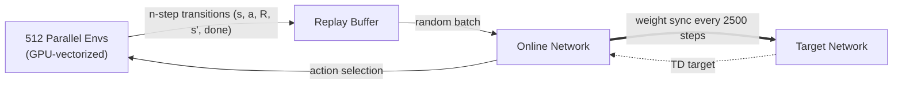
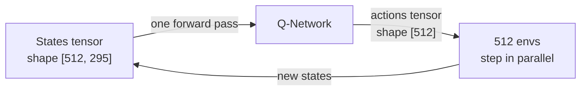
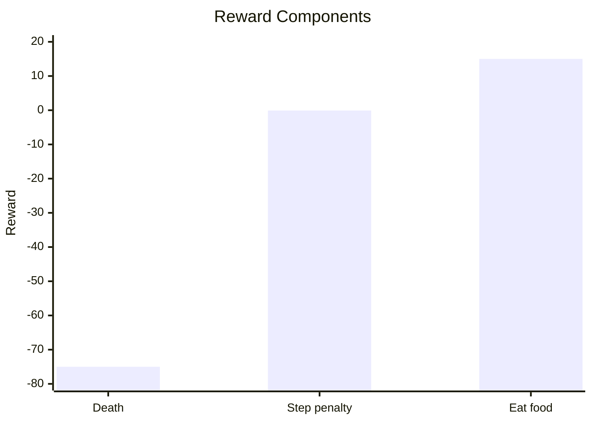
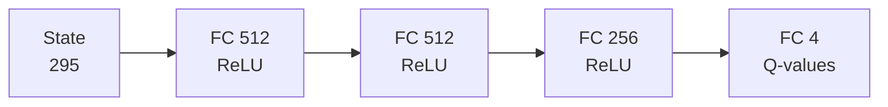
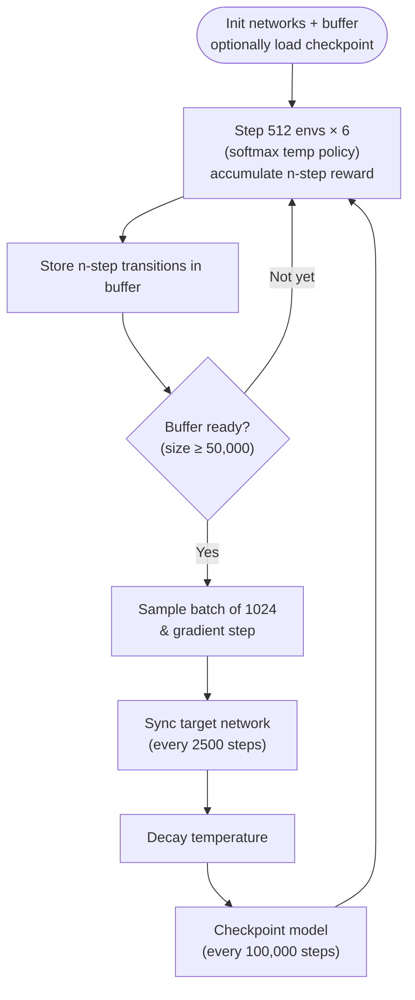

# 🐍 Snake-RL — Deep Q-Network with 512 Vectorized Environments

> A Snake AI trained from scratch using Deep Q-Learning (DQN), running **512 parallel environments** on GPU, with softmax temperature exploration, **6-step Bellman returns**, and a carefully tuned reward structure.

[](https://python.org)
[](https://pytorch.org)

---

## Table of Contents

- [What is this?](#what-is-this)
- [Architecture Overview](#architecture-overview)
- [How DQN Works](#how-dqn-works)
- [Vectorized Environments](#vectorized-environments)
- [Replay Buffer](#replay-buffer)
- [N-Step Bellman Returns](#n-step-bellman-returns)
- [Reward Structure](#reward-structure)
- [State Representation](#state-representation)
- [Neural Network](#neural-network)
- [Exploration — Softmax Temperature](#exploration--softmax-temperature)
- [Training Pipeline](#training-pipeline)
- [Project Structure](#project-structure)
- [Installation & Usage](#installation--usage)
- [Loading a Trained Model](#loading-a-trained-model)
- [Key Design Decisions](#key-design-decisions)

---

## What is this?

This project trains an AI agent to play Snake using **Deep Q-Network (DQN)** — the same algorithm that DeepMind used to master Atari games in 2015. The agent learns entirely through trial and error: it starts knowing nothing, dies constantly, and gradually figures out how to survive and grow.

What makes this implementation unusual:
- **512 Snake games run in parallel on the GPU** — no Python loops, pure tensor operations
- **Softmax temperature exploration** — a principled alternative to ε-greedy that decays automatically over training
- **6-step Bellman returns** — rewards are accumulated over a 6-step window before bootstrapping, speeding up credit assignment in this sparse-reward environment
- **Carefully tuned reward structure** — no distance shaping, just clean sparse rewards with the right relative scale

---

## Architecture Overview



Two networks with distinct roles:
- **Online network** — updated every step via gradient descent. It's what selects actions.
- **Target network** — a frozen copy, updated periodically (every 2500 steps). Used only to compute stable TD targets.

This decoupling is what makes DQN stable. Without it, you'd be chasing a moving target — literally.

---

## How DQN Works

### The Bellman Equation (1-step, for intuition)

At the core of DQN is the Bellman equation. For a given state `s` and action `a`:

```
Q(s, a) = r + γ · max_a' Q̂(s', a')
           └──────────────────────────┘
                  TD target (from target network)
```

- `r` — immediate reward
- `γ` — discount factor (how much we care about the future, currently 0.99)
- `s'` — next state
- `Q̂` — target network (frozen copy of the online network)

This project actually trains on the **n-step version** of this equation (n=6) — see the [N-Step Bellman Returns](#n-step-bellman-returns) section below for the full version actually used.

We train the online network to minimize the **TD error**:

```
Loss = (Q(s,a) - target)²
```

### Why a Replay Buffer?

Neural networks assume **i.i.d. data** (independent and identically distributed). But transitions from a game are highly correlated — step 5 is very similar to step 4. Training on sequential data causes the network to forget earlier lessons and diverge.

The replay buffer breaks this correlation by storing transitions and sampling **random mini-batches** from the full history.

### Why a Target Network?

Without a frozen target, every gradient step changes the Q-values we're trying to fit *and* the targets we're fitting toward. This creates a feedback loop that destabilizes training. The target network is updated slowly (hard copy every 2500 steps), keeping the training signal stable.

---

## Vectorized Environments

Instead of running one Snake game at a time, we run **512 in parallel** — all stored in a single GPU tensor.



**Why this matters:**
- A single GPU forward pass computes Q-values for all 512 states simultaneously
- The GPU is always saturated — no idle time waiting for Python to step one environment at a time
- ~512× more experience generated per wall-clock second compared to a single environment

The entire game logic (movement, collision detection, food spawning) is implemented as **batched tensor operations** — no Python for-loops over environments.

---

## Replay Buffer

Each transition stored is **not** a raw 1-step transition. It's the result of accumulating 6 steps (see next section): `(state_t, action_t, n_step_reward, state_{t+6}, done)`.

| Parameter | Value | Notes |
|---|---|---|
| Capacity | 10,240,000 | Doubled from an earlier 5.12M version to retain more diverse experience as training runs got longer |
| Batch size | 1024 | Doubled from 512 — larger batches give a more stable gradient estimate, which matters more once n-step returns add variance |
| Min size before training | 50,000 | Raised from 10,000 — ensures the agent doesn't start training on an almost-empty, low-diversity buffer |

Sampling is uniform random — every past transition has an equal chance of being drawn, regardless of when it was collected. This breaks the temporal correlation between consecutive game steps, which would otherwise destabilize training.

---

## N-Step Bellman Returns

> **Update:** this was previously listed as *planned*. It is now fully implemented and is the default training mode (n=6, after also testing n=4).

Instead of bootstrapping after a single step, rewards are accumulated over an `n`-step window before bootstrapping from the target network:

```
R = r_t + γ·r_{t+1} + γ²·r_{t+2} + ... + γ⁵·r_{t+5}
y = R + γⁿ · max_a' Q̂(s_{t+n}, a') · (1 - done)
```

The `(1 - done)` term is critical: if the snake dies anywhere inside the 6-step window, the bootstrap term is zeroed out — there's no "future" to estimate past death, so the target is just the accumulated reward.

**Why n=6, not n=4?**

The README originally proposed n=4 as a bias-variance compromise. In practice, after the architecture and batch size were scaled up (see below), n=6 was tested and worked well without destabilizing training — the larger batch size (1024) absorbs the extra variance that a longer window introduces. n=6 propagates the (sparse) food reward signal one and a half times further per gradient update than n=4 did.

**Handling parallel environment resets:**

With 512 environments resetting independently mid-window, a per-environment "already dead" mask (`n_step_dones`) ensures that once an environment dies inside the 6-step window, no further reward from its *next* episode leaks into the current accumulated return. Each environment's reward sum is frozen the moment it dies, even though the game itself resets immediately to keep all 512 slots active.

```mermaid
gantt
    title N-Step Return (n=6)
    dateFormat X
    axisFormat %s

    section Rewards collected
    r_t           :0, 1
    γ · r_{t+1}   :1, 2
    γ² · r_{t+2}  :2, 3
    γ³ · r_{t+3}  :3, 4
    γ⁴ · r_{t+4}  :4, 5
    γ⁵ · r_{t+5}  :5, 6

    section Bootstrap
    γ⁶ · maxQ(s_{t+6}) :6, 7
```



---

## Reward Structure

The reward design has to balance two things: giving the agent a clear signal to learn from, while not accidentally teaching it to exploit the reward function instead of actually playing well.

The final reward scheme uses three components:

| Event | Reward | Reason |
|---|---|---|
| Eat food | +15 | Strong positive signal for the goal (raised from +10 — see note below) |
| Step without eating | -0.1 | Discourages stalling and looping |
| Death | -75 | Strong deterrent, much larger than any step penalty |

> **Why +15 instead of +10?** With 6-step returns, a food reward picked up mid-window gets discounted by up to `γ⁵ ≈ 0.95` before reaching the start of the window — it no longer arrives at full strength the way it did under 1-step returns. Bumping it to +15 keeps the *effective* signal strength in the same range as the original 1-step design.



**What was tried and removed — distance shaping:**

An earlier version added a reward proportional to how much closer the snake moved toward the food each step. In theory this helps with sparse rewards; in practice the agent learned to **exploit it**: it would oscillate back and forth near the food, racking up small positive distance rewards without ever committing to eating. Removing it forced the agent to rely on the actual food reward, which produced cleaner behavior.

---

## State Representation

The network doesn't see the raw grid. Instead, each environment computes a **flat feature vector** of 295 values:

| Feature | Size | Description |
|---|---|---|
| Food delta (dx, dy) | 2 | Signed distance from head to food |
| Current direction (one-hot) | 4 | UP / DOWN / LEFT / RIGHT |
| Vision rays | 289 | Local obstacle/body/food info within a radius-8 window around the head (17×17 grid) |

This gives the agent enough context to reason about immediate danger and food direction without processing a full grid image.

---

## Neural Network

The Q-network is a **fully-connected MLP** — no convolutions. The input is the 295-dimensional state vector described above.



> **Update:** the network was widened from `256 → 256 → 128` to `512 → 512 → 256`. The larger capacity gives the model more room to represent the longer-horizon value estimates that come with 6-step returns, and empirically helped push past a score plateau the smaller network hit around best-score ~160.

**Output:** 4 Q-values, one per action (UP, DOWN, LEFT, RIGHT). During training, actions are sampled proportionally to `softmax(Q / temp)` — see the next section. At evaluation, we take `argmax`.

---

## Exploration — Softmax Temperature

Instead of ε-greedy (which picks a random action with probability ε), this implementation uses **softmax temperature** to control exploration:

```python
temp = max(0.05, 1 - step / total_steps)

probs = torch.softmax(q_values / temp, dim=1)
actions = torch.multinomial(probs, num_samples=1).squeeze()
```

`temp` starts at 1.0 and decays linearly to a floor of **0.05** (lowered from 0.1) over the course of training, to allow sharper exploitation once the policy is already strong — relevant for runs that resume from a previously trained checkpoint rather than starting from scratch.

**What this means in practice:**
- **High temp (early training):** `softmax(Q / 1.0)` — the distribution is spread out, all actions get a fair chance. The agent explores broadly.
- **Low temp (late training):** `softmax(Q / 0.05)` — the distribution becomes very sharp around the best action. The agent exploits what it has learned almost greedily.

Compared to ε-greedy, softmax temperature is more informative: even during exploration, *better* actions are sampled more often. The agent never picks a move it thinks is terrible with the same probability as a move it thinks is great.

---

## Training Pipeline



---

## Project Structure

```
Snake-RL/
├── ModelSnake.py           # DQN networks + replay buffer + n-step training loop
├── snake_game_base.py      # Vectorized Snake environment (512 parallel games)
├── snake_viewer.py         # Tkinter visualization for inspecting an agent
└── snake_dqn_1M.pth        # Trained model checkpoint (512-512-256 architecture)
```

> Flat layout — this is a prototype focused on iteration speed. A production version would split the DQN agent, the replay buffer, and the training loop into separate modules.

---

## Installation & Usage

### Requirements

- Python 3.x
- PyTorch with CUDA
- NVIDIA GPU recommended (CPU training is very slow)

```bash
git clone https://github.com/tmininihub/snake-rl.git
cd snake-rl

python -m venv venv
source venv/bin/activate  # Windows: venv\Scripts\activate

pip install torch torchvision --index-url https://download.pytorch.org/whl/cu124
pip install numpy
```

### Train

```bash
python ModelSnake.py
```

This will train from scratch by default. To resume from the included checkpoint instead, see below.

### Watch it play

The training script calls `viewer.draw(...)` every step by default, so a live Tkinter window opens automatically showing environment 0.

---

## Loading a Trained Model

A trained checkpoint (`snake_dqn_1M.pth`) is included in this repo. It matches the **512 → 512 → 256** architecture described above — loading it into a differently-shaped network will fail.

```python
import torch
from ModelSnake import DQN  # or redefine the same architecture

device = torch.device("cuda" if torch.cuda.is_available() else "cpu")
q_network = DQN().to(device)
q_network.load_state_dict(torch.load("snake_dqn_1M.pth", map_location=device))
q_network.eval()
```

For pure inference (no training), use `argmax` instead of softmax sampling:

```python
with torch.no_grad():
    q_values = q_network(state)
    action = torch.argmax(q_values, dim=1)
```

---

## Key Design Decisions

**Why not use OpenAI Gym?**
Standard Gym environments step one environment per call. At hundreds of parallel envs, the Python overhead per step becomes the bottleneck. Custom GPU-vectorized envs eliminate this entirely.

**Why softmax temperature instead of ε-greedy?**
ε-greedy treats all non-greedy actions equally — a move the network rates at -10 and a move it rates at +8 both get picked with the same probability ε/4. Softmax temperature respects the Q-value ordering even during exploration: better actions are always more likely, which produces higher-quality exploratory behavior.

**Why a flat buffer?**
A single contiguous allocation is simpler and faster than managing one buffer per environment. The index arithmetic is trivial and the memory layout is cache-friendly.

**Why remove distance shaping?**
Distance reward is a heuristic — it can be optimal to move *away* from food temporarily to avoid trapping yourself. In practice the agent exploited it by oscillating near the food instead of eating. Clean sparse rewards produced better behavior.

**Why move from n=4 (planned) to n=6 (implemented)?**
Once batch size and network capacity were increased, the extra variance from a longer return window stopped being a bottleneck, and n=6 propagated reward signal further per update without destabilizing training.

---

## References

- [Mnih et al. (2015) — Human-level control through deep reinforcement learning](https://www.nature.com/articles/nature14236)
- [Sutton & Barto — Reinforcement Learning: An Introduction](http://incompleteideas.net/book/the-book-2nd.html)
- [PyTorch Documentation](https://pytorch.org/docs/)
